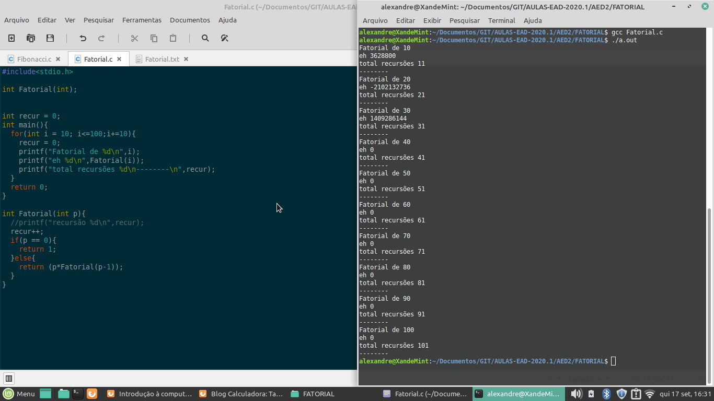
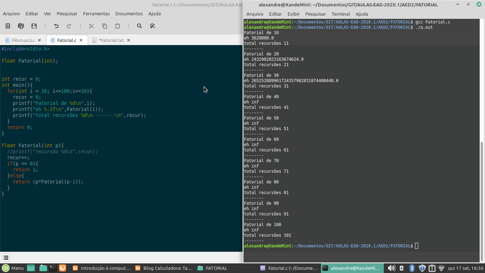
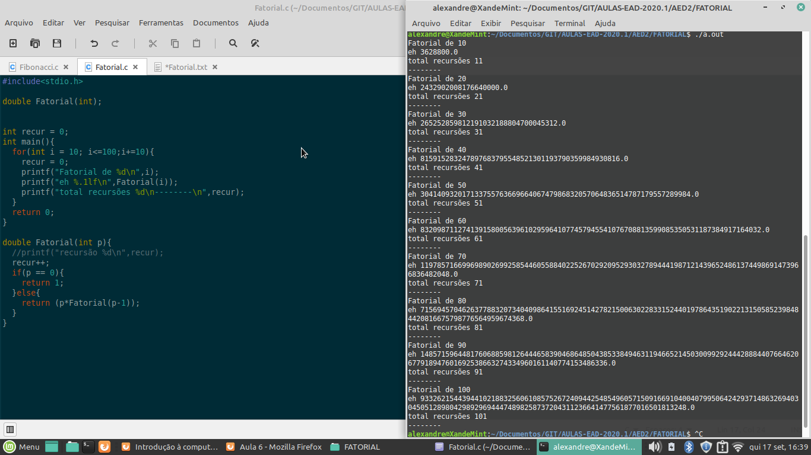
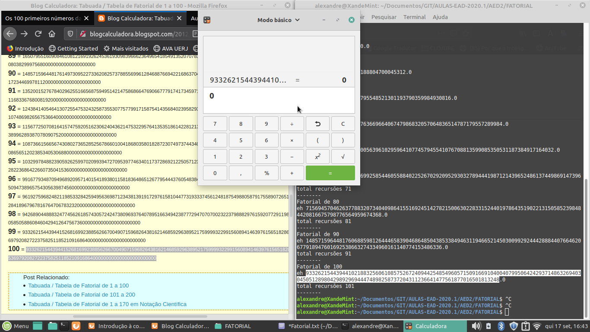

# Relatório Fatorial Recursivo  
Inicialmente eu criei o código com um for que itera de 10 em 10, indo de 10 a 100.  
Mas ao executar o código notei algumas coisas.  
Primeiro que a quantidade de recursões é igual ao valor inserido +1 (N+1).  
Segundo que o resultado começava a apresentar anormalidade apartir do fatorial de 40.  
Checando o código percebi que isso ocorria devido ao fato de ter printado em formato inteiro a resposta.  

Então para fins de teste, decidi usar o tipo float com 1 casa decimal, mesmo sabendo que ele enfrentaria o mesmo problema.  

A solução foi usar o tipo double, assim consegui obter o resultado esperado. Pois o valor fatorial aumenta consideravelmente, que os tipos int e float são incapazes de aramazenar.  

Usando o site http://blogcalculadora.blogspot.com/2012/08/tabuada-tabela-de-fatorial-de-1-100.html e a calculadora eu pude checar se os valores obtidos estavam corretos.  

