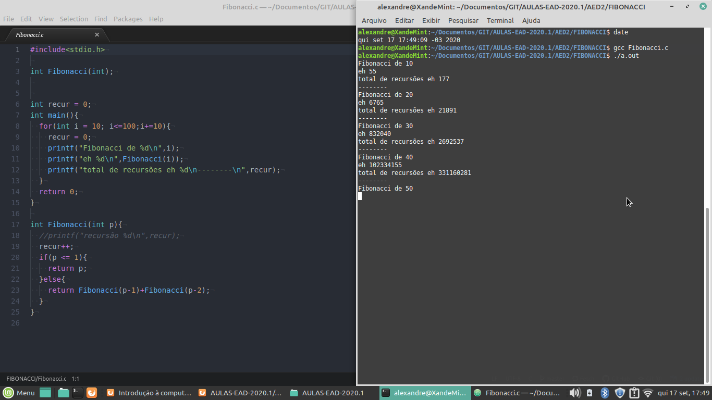
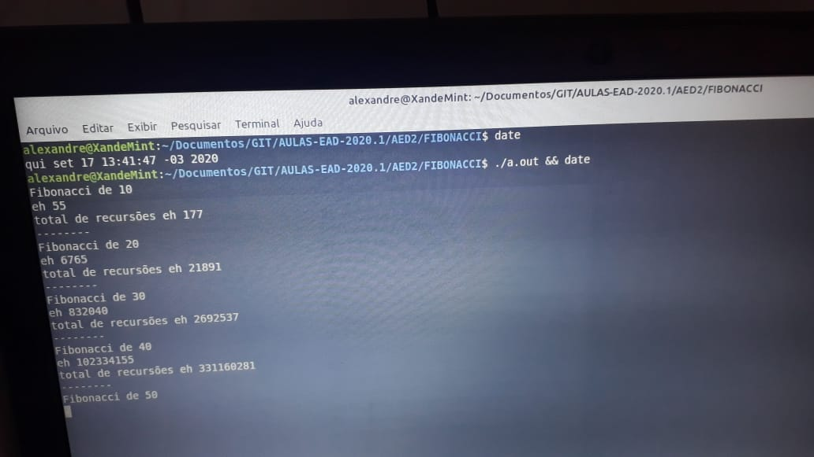
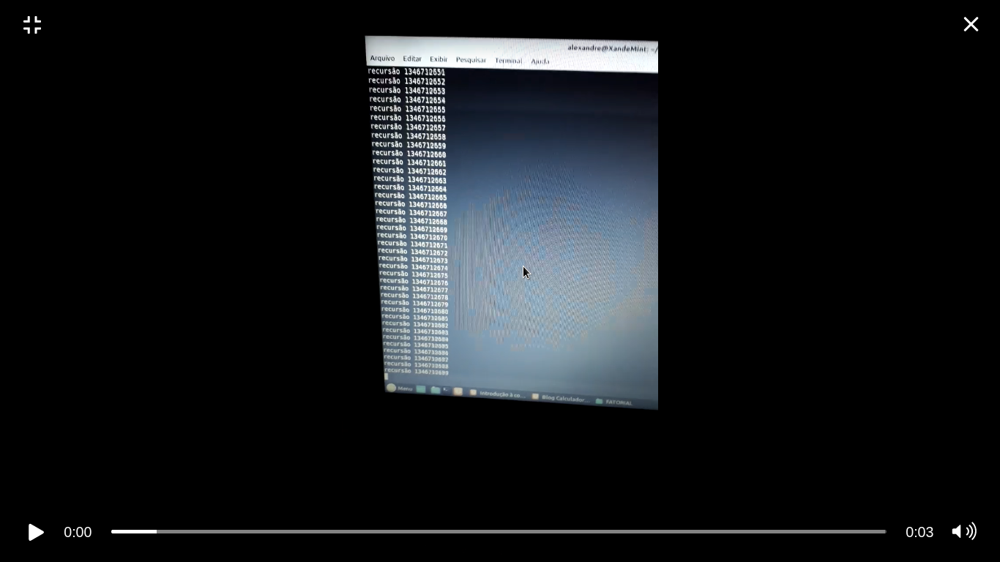
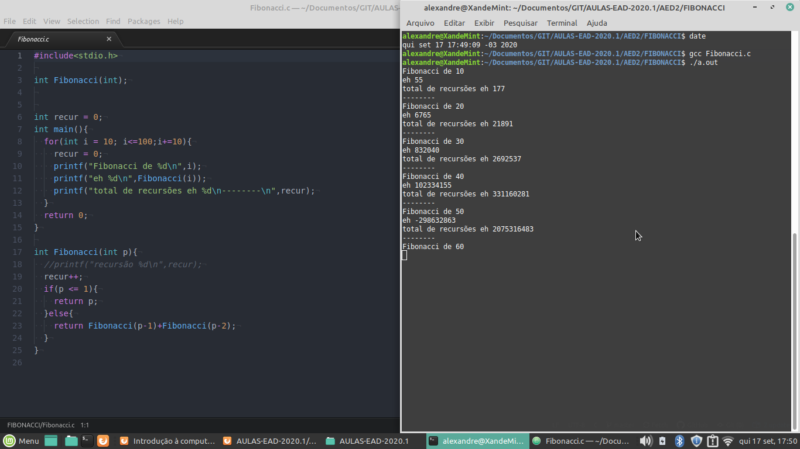

# Relatório Fibonacci Recursivo  
Inicialmente eu criei o código com um for que itera de 10 em 10, indo de 10 a 100.  
Mas ao executar o código notei que o programa estava demorando demais para terminar sua execução.  
Ele parava na execução do Fibonacci de 50, e após alguns segundos iniciava o Fibonacci de 60.  
Passaram-se mais de 1hora de execução e o programa ainda não havia calculado o Fibonacci de 60.  

  

  

Querendo entender o motivo da demora, alterei o código para printar na tela a cada nova recursão iniciada e assim averiguar se o programa estava travando.  
Novamente após 1 hora de execução pude notar que a quantidade de recursões já estava acima de 1346763324 e continuava sem parar a entrar em outras recursões.  

Analisando melhor, pude observar que o Fibonacci de 10 necessitava de 55 recursões e que o Fibonacci de 20 necessitava de 6765 recursões e o de 30 precisava de 832040, logo percebi que o Fibonacci de 60 seria um número muito maior, e após constatar que após 1 hora de execução o valor ainda não tinha sido encontrado, encerrei os testes pois possivelmente este programa precisaria de no mínimo alguns dias para achar o valor de 60.  
Cheguei a conclusão que este programa seria incapaz de ser executado pois possivelmente ele levaria muito tempo para terminar, visto que o mesmo ainda iria calcular o Fibonacci de 70, 80, 90 e 100.  

Oque torna seu uso inviável.  
